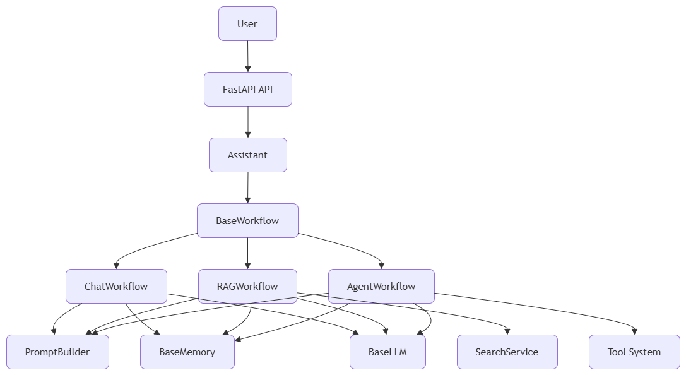

# AI Assistant

> A production-oriented AI assistant framework built from first principles with a strong focus on architecture, modularity, and provider independence.


## Architecture

The assistant is built around a modular, workflow-driven architecture with provider-independent abstractions and reusable components.



The project focuses on implementing the surrounding architecture from first principles while keeping language model providers interchangeable through clean abstractions.


## Project Goals

This project aims to understand and build the core components behind modern AI assistants from first principles before adopting higher-level frameworks.

Instead of treating AI frameworks as black boxes, every major subsystem is implemented independently to understand the underlying architecture, engineering decisions, and design trade-offs.

The long-term objective is to evolve this project into a production-ready AI assistant framework by gradually integrating modern technologies such as Docker, Model Context Protocol (MCP), LangChain, LangGraph, vLLM, and other industry-standard tools while preserving a deep understanding of how every component works internally.


## Features

- Built from first principles
- Provider-independent architecture
- Modular workflow system
- Persistent conversation memory
- Retrieval-Augmented Generation (RAG)
- Custom document ingestion pipeline
- Custom retrieval pipeline
- Embedding abstractions
- Vector store abstractions
- Tool execution framework
- Agent workflow foundation
- Planning abstraction
- FastAPI backend
- Dependency Injection
- Clean Architecture
- Extensive documentation
- Comprehensive automated tests


## Philosophy

This project is not intended to be just another AI application.

Its primary goal is to understand how modern AI assistants work internally by building every major component from first principles before relying on higher-level frameworks.

The project emphasizes:

- Clean software architecture
- Modular design
- Provider independence
- Incremental development
- Production-ready engineering practices

Frameworks are considered valuable engineering tools, but they should be introduced only after understanding the problems they solve.

**The project intentionally prioritizes understanding before abstraction.**


## Requirements

- Python 3.10+


## Installation

Clone the repository:

```bash
git clone https://github.com/Kutlay07/ai-assistant.git
cd ai-assistant
```

Create a virtual environment:

```bash
python -m venv .venv
```

Activate it.

### Windows

```bash
.venv\Scripts\activate
```

### Linux / macOS

```bash
source .venv/bin/activate
```

Install dependencies:

```bash
pip install -r requirements.txt
```


## Running the API

Start the development server:

```bash
python -m fastapi dev src/ai_assistant/api/main.py
```

Interactive API documentation:

```
http://127.0.0.1:8000/docs
```

ReDoc documentation:

```
http://127.0.0.1:8000/redoc
```


## Project Structure

```text
src/
└── ai_assistant/
    ├── api/
    ├── core/
    ├── dependencies/
    └── ...

docs/
├── architecture/
├── decisions/
├── diagrams/
├── development.md
└── roadmap.md

tests/
```


## Documentation

Detailed project documentation is available in the `docs/` directory.

### Architecture

- Assistant
- Workflows
- Memory
- LLM
- Retrieval
- Planner
- Tools
- Lifecycle

### Engineering

- Development Workflow
- Roadmap
- Architecture Decision Records (ADRs)


## Testing

Run the complete test suite:

```bash
pytest
```

Current status:

- 112+ automated tests
- Unit tests
- Integration tests


## Roadmap

**Current Version**

**v1.0.0**

Implemented components:

- Assistant orchestration
- Workflow system
- Provider-independent LLM abstraction
- Prompt builder
- Persistent conversation memory
- Retrieval-Augmented Generation (RAG)
- Tool system
- Agent workflow foundation
- Planning abstraction
- FastAPI backend
- Comprehensive documentation
- Automated test suite

**Future milestones**

- Better retrieval
- Advanced agent reasoning
- MCP integration
- Docker support
- Modern AI framework integrations
- Web interface
- Production deployment

For the complete roadmap, see:

```
docs/roadmap.md
```


## License

This project is licensed under the MIT License.