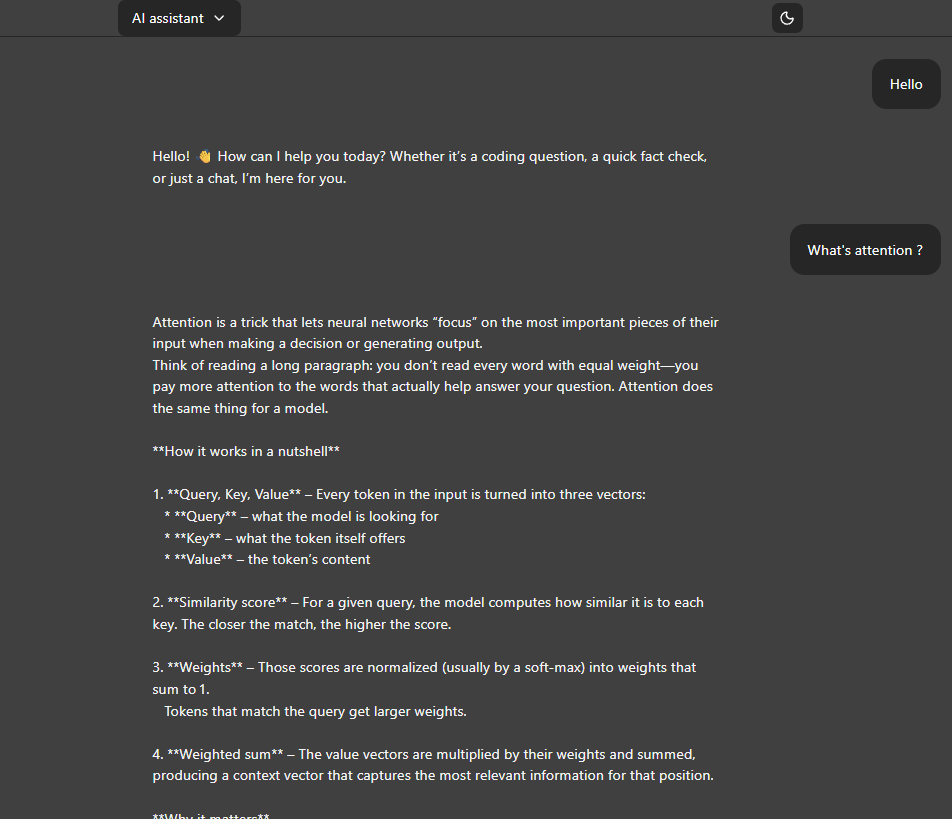
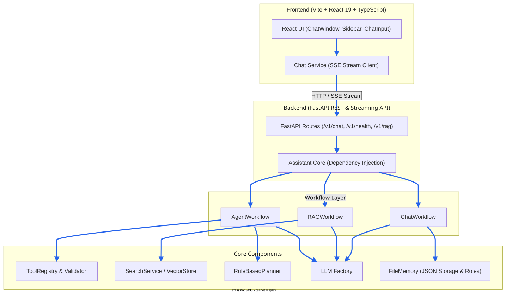

# AI Assistant

> A production-oriented AI assistant framework built from first principles with a strong focus on clean architecture, modularity, provider independence, and full-stack integration.


---

## 📸 Demo



*A real-time conversation using the React frontend with Server-Sent Events (SSE) streaming.*

---

## 🏛️ Architecture

The AI Assistant is built around a modular, workflow-driven monorepo architecture featuring a **FastAPI** backend and a **Vite + React 19** frontend UI.



The project emphasizes implementing all core AI assistant components from first principles while keeping language model providers, vector stores, and memory backends completely interchangeable through clean abstractions.

---

## 🎯 Project Goals & Philosophy

This project aims to understand and construct the underlying subsystems behind modern AI assistants before adopting high-level black-box frameworks.

Key principles:
- **Build from First Principles**: Understand internal mechanisms before wrapping them in abstractions.
- **Provider Independence**: Core application logic depends exclusively on abstract interfaces (`BaseLLM`, `BaseMemory`, `BaseRetriever`, `BaseTool`, `BasePlanner`), making concrete providers (Groq, OpenAI, local models) pluggable.
- **Clean Architecture & Dependency Injection**: Strict decoupling between API layers, workflows, domain models, and external services.
- **Full-Stack Execution**: End-to-end integration featuring real-time Server-Sent Events (SSE) streaming responses in the React UI.

---

## ✨ Features

- **Full-Stack UI**: Modern React 19 + TypeScript + TailwindCSS v4 web interface with SSE streaming support.
- **Provider-Independent LLM Engine**: Supports Groq (`groq_provider.py`), Local models (`local_provider.py`), and Mock providers (`mock_llm.py`) through `LLMFactory`.
- **Persistent Conversation Memory**: Role-aware persistent JSON conversation memory (`FileMemory`) supporting `system`, `user`, `assistant`, and `tool` message roles.
- **Multi-Step Agent & Planning**: `AgentWorkflow` with `RuleBasedPlanner` and `ToolCallValidator` + `ToolRegistry` for tool calling execution.
- **Retrieval-Augmented Generation (RAG)**: Complete document ingestion pipeline (`PDFLoader`, `TextLoader`, `TextSplitter`, `MockEmbedder`, `MockVectorStore`, `SearchService`).
- **Real-Time Streaming**: FastAPI SSE streaming endpoint (`/v1/chat/stream`) for token-by-token live output.
- **Production Testing**: 100% passing test suite with 113 automated unit & integration tests.

---

## 📁 Monorepo Structure

```text
ai-assistant/
├── backend/                  # FastAPI Backend & Core AI Engine
│   ├── main.py               # Application entry point
│   ├── pyproject.toml        # Dependencies and pytest configuration
│   ├── src/
│   │   └── ai_assistant/
│   │       ├── api/          # FastAPI endpoints (v1/chat, v1/health, v1/rag) & schemas
│   │       └── core/         # Workflows, LLMs, Memory, RAG, Tools, Planners
│   └── tests/                # 113 unit and integration tests
├── frontend/                 # React 19 + Vite Web Application
│   ├── src/                  # Chat UI components, SSE service, types
│   ├── package.json
│   └── vite.config.ts
├── docs/                     # Comprehensive Project Documentation
│   ├── architecture/         # Deep-dive architecture specs
│   ├── decisions/            # Architecture Decision Records (ADR-0001, ADR-0002)
│   ├── diagrams/             # Editable SVG architecture diagrams
│   ├── development.md        # Development workflow guide
│   └── roadmap.md            # Version roadmap and status
└── README.md
```

---

## 🚀 Quick Start

### Prerequisites
- Python 3.10+
- Node.js 18+ & npm

### 1. Backend Setup

```bash
cd backend

# Create and activate virtual environment
python -m venv .venv

# Windows:
.venv\Scripts\activate
# Linux/macOS:
source .venv/bin/activate

# Install dependencies
pip install -r requirements.txt
```

Start the FastAPI development server:
```bash
python main.py
```
* API Documentation (Swagger): `http://127.0.0.1:8000/docs`
* ReDoc: `http://127.0.0.1:8000/redoc`

### 2. Frontend Setup

In a new terminal window:

```bash
cd frontend

# Install dependencies
npm install

# Start Vite dev server
npm run dev
```
Open `http://localhost:5173` in your browser.

---

## 🧪 Testing

Run the complete backend automated test suite:

```bash
cd backend
python -m pytest
```

Current test coverage:
- **113 tests passed, 0 failed**
- Unit tests for all core modules (LLMs, Memory, Workflows, Tools, RAG)
- Integration tests for API endpoints & SSE streaming

Run frontend build verification:
```bash
cd frontend
npm run build
```

---

## 🗺️ Roadmap & Release Status

### Current Version: `v1.0.0 - Initial Stable Release`

Completed Milestones:
- [x] Full-Stack Web Interface (Vite + React 19 + TailwindCSS)
- [x] Assistant Orchestrator & Workflows (`ChatWorkflow`, `RAGWorkflow`, `AgentWorkflow`)
- [x] LLM Abstraction & Groq/Local/Mock Provider Integration (`LLMFactory`)
- [x] Role-Based Persistent File Memory (`FileMemory`)
- [x] Tool Calling & Execution Framework (`ToolRegistry`, `ToolCallValidator`)
- [x] Agent Multi-Step Planning (`RuleBasedPlanner`)
- [x] RAG Ingestion & Document Search Pipeline
- [x] FastAPI REST & Real-Time SSE Streaming Endpoints
- [x] Comprehensive Test Suite (113 passing tests)

For future milestones (Docker containerization, MCP protocol integration, vLLM support), see [docs/roadmap.md](docs/roadmap.md).

---

## 📄 License

This project is licensed under the MIT License.